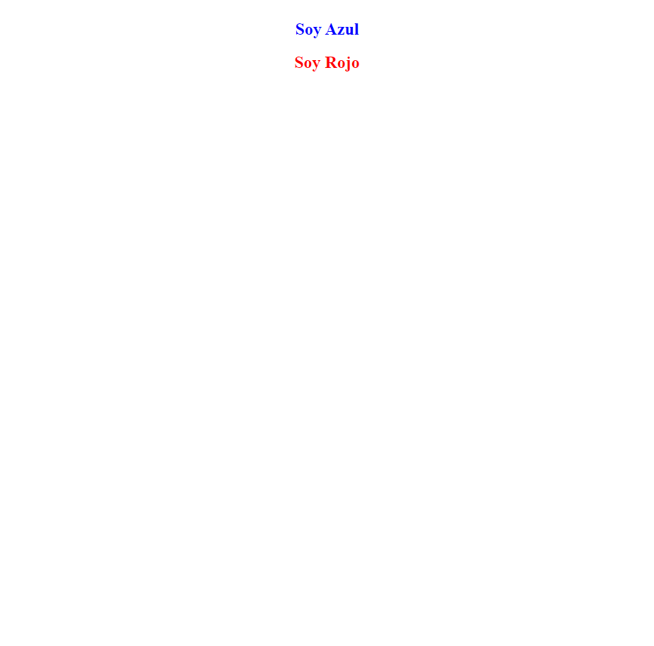
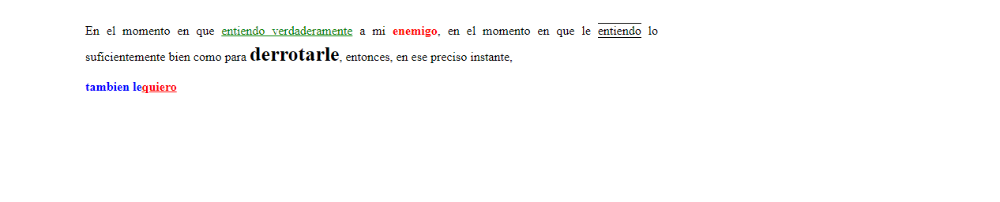
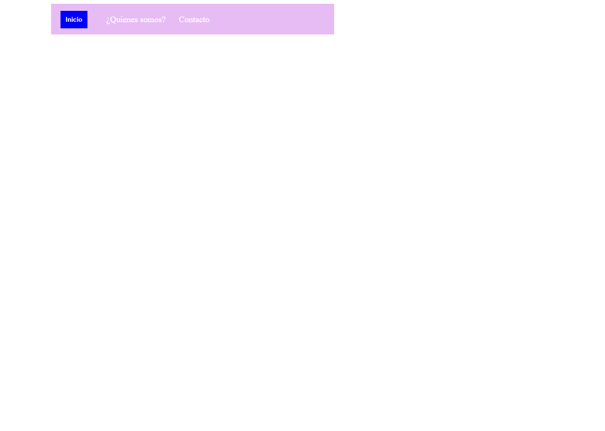
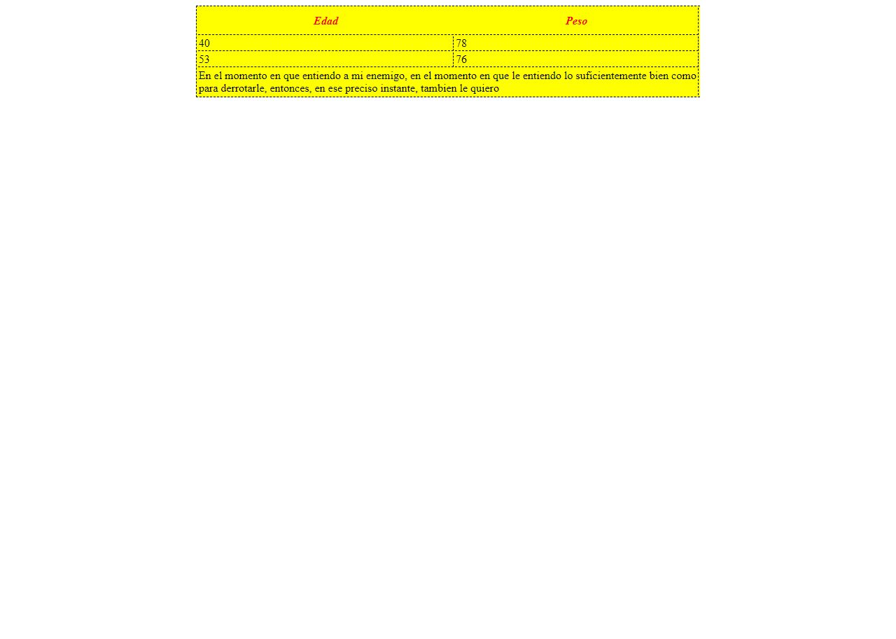
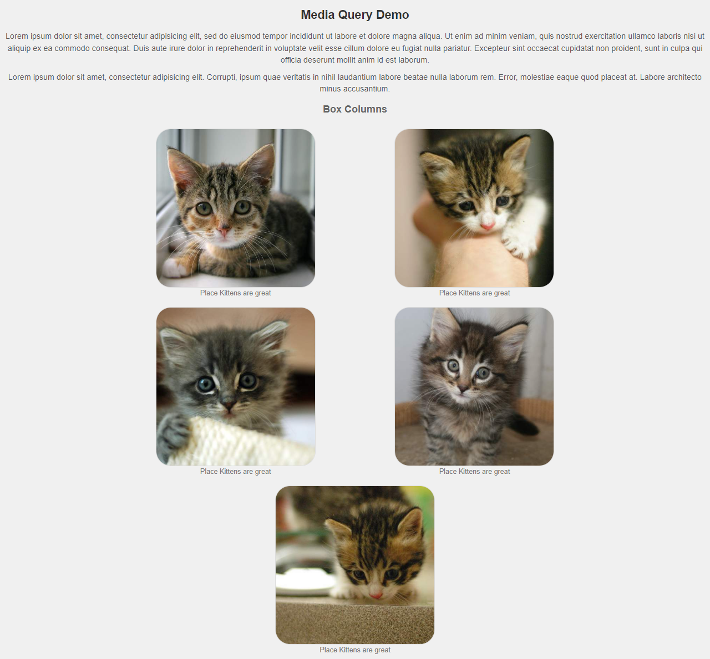
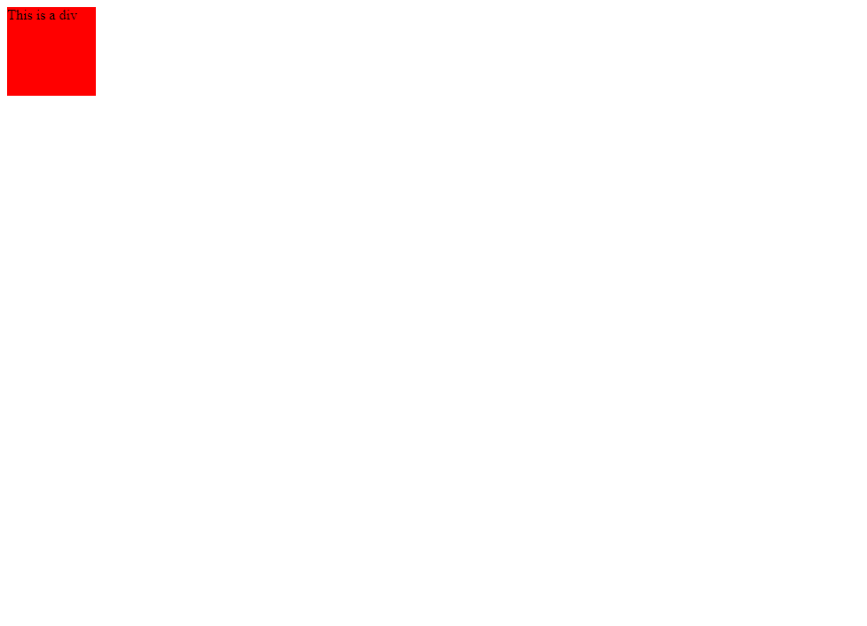

<h1>TALLER MARIA ANGELICA RINCON</h1>

Curso: Full Stack Intermedio

<h2>Punto 1: Wireframe de Figma</h2>

<h3>LINK PAGINA WEB GITHUB</h3>
<a href="https://angela-2017.github.io/TALLER_5_FULLSTACK_INTERMEDIO/" target="blank">Link pagina web</a>

<h2>Punto 2: Pagina web con solo codigo HTML</h2>

<h2>Punto 3: Pagina web con solo codigo CSS</h2>

<h2>Punto 4: HTML Y CSS</h2>

<h2>Punto 5: HTML Y CSS</h2>

<h2>Punto 6: HTML Y CSS</h2>

<h2>Punto 7: HTML Y CSS</h2>

<h2>Punto 8: HTML Y CSS</h2>

<h2>Punto 9: Codigo html</h2>

<h2>Punto 10: Codigo CSS</h2>

<h2>Punto 11: Codigo </h2>
