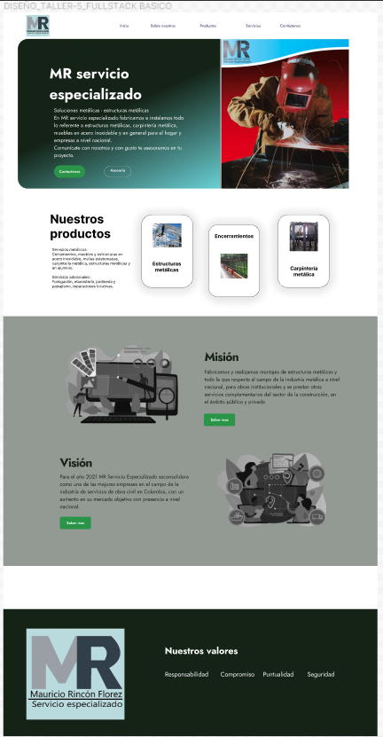
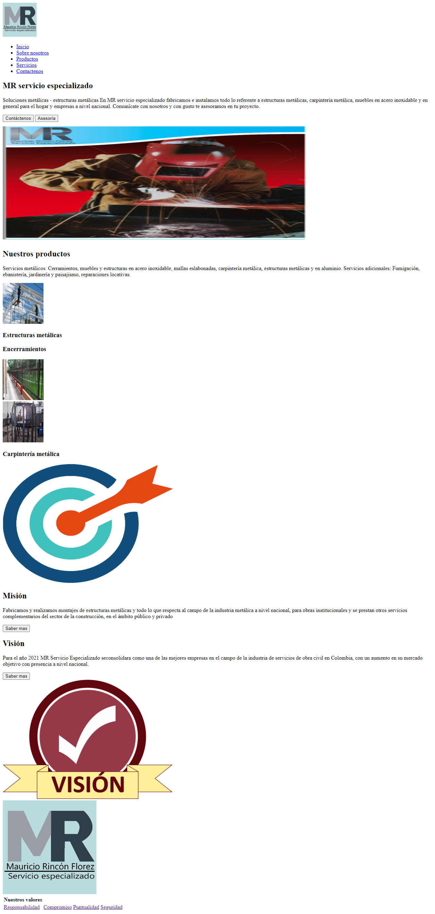
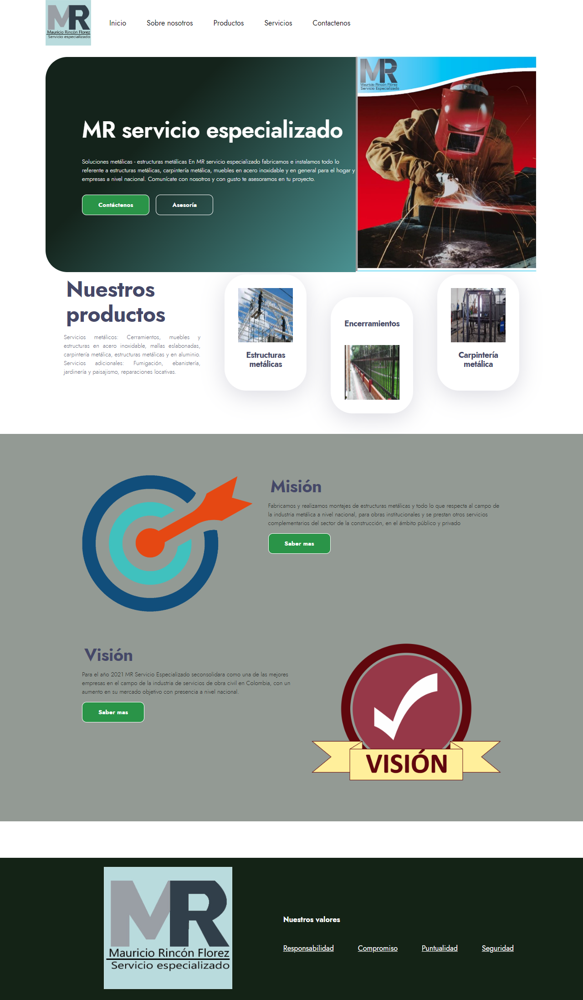

<h1>TALLER ANGELICA RINCON</h1>

<h2>Informacion</h2>

Curso: Full Stack Intermedio

<h2>Punto 1: Wireframe de Figma</h2>

<h3>LINK PAGINA WEB GITHUB/h3>
<a href="" target="blank">Link pagina web</a>

<h2>Punto 2: Pagina web con solo codigo HTML</h2>

<h2>Punto 3: Pagina web con solo codigo CSS</h2>

<h2>Punto 4: HTML Y CSS</h2>
